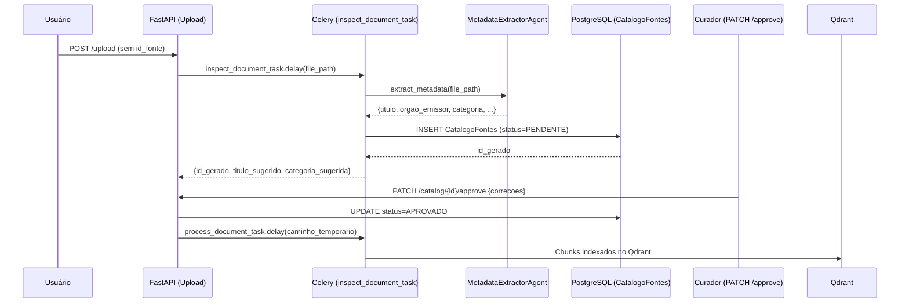

# Relatório Técnico — Arquitetura Human-in-the-Loop e Pipeline de Ingestão Inteligente

**Data:** 20 de Abril de 2026  
**Projeto:** TCC — Assistente Inteligente para Análise de Prescrições Agronômicas  
**Sessão:** Implementação completa do fluxo de upload sem ID, extração cognitiva de metadados e curadoria humana pré-vetorização

---

## 1. Objetivo

Concluir a implementação da arquitetura **Human-in-the-Loop** desenhada no brainstorming do dia 18/04, tornando a esteira de ingestão do sistema RAG capaz de operar sem que o usuário precise cadastrar previamente a fonte antes do upload. O sistema passou a utilizar um agente LLM para classificar e catalogar documentos de forma autônoma, aguardando revisão humana antes de vetorizar o conteúdo.

**Justificativa:** A exigência de dois passos manuais sequenciais (Criar Registro → Upload) criava fricção inaceitável para ingestão em escala. Com a automação cognitiva do cadastro, o sistema respeita a rastreabilidade imposta pela arquitetura Poliglota sem bloquear o fluxo operacional do usuário.

---

## 2. Decisões Arquiteturais

### 2.1 Roteamento Condicional na Rota de Upload

A rota `POST /ingestion/upload` foi refatorada para aceitar o campo `id_fonte` como **opcional**. O roteamento entre os dois fluxos de trabalho ocorre diretamente no endpoint:

```
Upload com id_fonte declarado  → process_document_task (ingestão direta no Qdrant/PostgreSQL)
Upload SEM id_fonte             → inspect_document_task (inspeção LLM + salva PENDENTE)
```

Esta bifurcação mantém retrocompatibilidade com o fluxo já existente e não exige mudanças nos clientes que já fornecem o ID.

### 2.2 Agente de Extração Cognitiva (`MetadataExtractorAgent`)

Foi criado o módulo `core/agents/metadata_extractor.py`, responsável por ler uma amostra do arquivo recém-chegado (primeiros 1.000 caracteres do PDF ou primeiras 5 linhas do CSV) e invocar um modelo LLM para extrair três campos obrigatórios do Catálogo:

- `titulo` — nome descritivo do documento
- `orgao_emissor` — instituição de origem (ex: Embrapa, MAPA, Jacto)
- `categoria_agronomica` — restrito a: Solos, Defensivos, Sementes, Clima, Maquinário, Geral

### 2.3 Resiliência com Fallback Duplo de LLM

O agente opera com **dois provedores em cascata**:

1. **Ollama (primário):** Chamada REST ao endpoint local `OLLAMA_BASE_URL/api/generate` com `format: "json"` garantindo output estruturado.
2. **llama.cpp (fallback):** Acionado automaticamente se o Ollama lançar qualquer exceção. Usa o endpoint `LLAMA_CPP_BASE_URL/chat/completions` (formato OpenAI-compatible), com parsing defensivo que remove blocos de código Markdown e corrige JSONs truncados.
3. **Metadados padrão:** Caso ambos os provedores falhem, o sistema persiste o registro com valores seguros (`"Documento Rascunho"`, `"Indefinido"`, `"Geral"`) sem bloquear a esteira.

### 2.4 Status de Processamento no Catálogo

A tabela `CatalogoFontes` recebeu dois novos campos:

| Campo | Tipo | Finalidade |
|---|---|---|
| `status_processamento` | String | Ciclo de vida do documento: `APROVADO` (padrão), `PENDENTE`, `REJEITADO` |
| `caminho_temporario` | Text | Endereço físico do arquivo aguardando aprovação humana |

O campo `status_processamento` possui `default="APROVADO"` para preservar a semântica dos registros criados pelo fluxo manual existente (que não passam pelo ciclo de revisão).

---

## 3. Fluxo Completo Implementado



---

## 4. Stack Utilizada / Modificada

| Componente | Tecnologia | Mudança |
|---|---|---|
| **Rota de Upload** | FastAPI | `id_fonte` tornou-se `Optional[int]` com roteamento condicional |
| **Rota de Catálogo** | FastAPI | Nova rota `PATCH /{id}/approve` adicionada |
| **Agente Cognitivo** | httpx + Ollama/llama.cpp | Novo módulo `core/agents/metadata_extractor.py` |
| **Worker de Inspeção** | Celery | Nova task `inspect_document_task` |
| **Modelo de Dados** | SQLAlchemy + Alembic | Colunas `status_processamento` e `caminho_temporario` em `CatalogoFontes` |
| **PDF Processor** | PyMuPDF + Ollama + LlamaParse | Chain of Responsibility consolidada (nó Local → Validator → Fallback Premium) |

---

## 5. Implementação do `PDFProcessor` — Chain of Responsibility

Paralelamente ao fluxo Human-in-the-Loop, o `PDFProcessor` foi refatorado para o padrão **Chain of Responsibility** com três nós especializados, conforme o prompt de arquitetura elaborado anteriormente:

### 5.1 Nós da Cadeia

**Node 1 — `LocalParserNode` (Custo: Zero)**
- Utiliza **PyMuPDF (fitz)** para extração de texto página por página
- Detecta e converte tabelas para Markdown via `page.find_tables()`
- Aciona **EasyOCR** automaticamente em páginas com menos de 50 caracteres extraídos (threshold `_OCR_THRESHOLD`)
- Logs explícitos indicam quantas páginas precisaram de OCR

**Node 2 — `LLMValidatorNode` (Custo: Zero — Ollama Local)**
- Recebe os `Documents` do `LocalParserNode` e concatena o texto bruto
- Invoca o LLM local via `BaseChatModel` para classificar a extração em `boa`, `parcial` ou `falha`
- Implementa **retry automático de até 2 tentativas** (`MAX_RETRIES = 2`) em caso de `ValidationError` ou `JSONDecodeError`, injetando o erro anterior no prompt da retentativa
- Se o LLM retornar `qualidade == "falha"`, levanta `LLMValidationFailed` para acionar o próximo nó

**Node 3 — `LlamaParseNode` (Custo: API Premium)**
- Acionado **apenas** se o `LLMValidatorNode` esgotar seus retries
- Implementa **Lazy Loading**: o cliente LlamaParse é instanciado somente no primeiro uso, evitando consumo de memória em cold start
- Logs explícitos com tag `[CUSTO: LLAMAPARSE]` para rastreamento de custos

### 5.2 Comportamento de Degradação Graciosa

```
Ollama indisponível → extração local sem validação (tag: local_unvalidated)
LlamaParse sem chave configurada → extração local sem validação
Ambos falham → ValueError propagado ao Worker (Celery faz retry em 10s)
```

O Qdrant sabe qual nó gerou o documento. Todos os `Documents` saem com o campo `extraction_node` nos metadados para rastreamento de métricas de custo, e a interface de persistência é a mesma.

---

## 6. Limpeza de Arquivos Temporários

Foi implementada a função `_cleanup_expired_temp_files()` no `ingestion_worker.py`, chamada no início de cada task. Remove arquivos do diretório `temp_uploads/` com mais de **24 horas** (configurável via variável de ambiente `TEMP_FILE_TTL_SECONDS`), prevenindo acúmulo de disco em casos onde o curador humano nunca aprova nem rejeita o documento.

---

## 7. Segurança no Upload

A rota de upload implementa defesas contra path traversal e payloads maliciosos:
- Nome do arquivo substituído por UUID aleatório (`uuid4().hex + extensão`)
- Verificação de que o `save_path` resolve dentro do `TEMP_DIR` (proteção contra `../`)
- Limite de tamanho: arquivos acima de **100MB** rejeitados com HTTP 413
- Extensões aceitas restritas a `.pdf` e `.csv`

---

## 8. Resultado Final

A plataforma de ingestão evoluiu para um modelo de **esteira inteligente em dois estágios**:

1. **Estágio 1 — Inspeção Autônoma:** O usuário apenas arrasta o arquivo. A IA classifica, nomeia e cataloga automaticamente o documento como `PENDENTE`.
2. **Estágio 2 — Curadoria Humana:** Um curador revisa a sugestão da IA via `PATCH /catalog/{id}/approve`, corrige eventuais erros (título errado, órgão emissor incorreto) e aciona a vetorização real com um único clique.

O contrato de rastreabilidade permanece 100% garantido: **nenhum dado chega ao Qdrant sem ter uma âncora em `CatalogoFontes` com `id_fonte` validado e aprovado por um humano.**

---

## 9. Lições Aprendidas e Padrões Estabelecidos

| Situação | Problema | Padrão Correto |
|---|---|---|
| **Upload sem ID prévio** | Dois passos manuais bloqueavam fluxos em escala | Roteamento condicional + `inspect_document_task` com LLM |
| **LLM retornando Markdown no JSON** | `json.loads()` falhava com blocos ` ```json ` | Parsing defensivo: strip de prefixos/sufixos antes da deserialização |
| **JSON truncado pelo LLM** | Respostas cortadas no max_tokens quebravam a estrutura | Append de `"\n}"` quando o conteúdo não terminava em `}` |
| **Memória com LlamaParse** | Importar o cliente no `__init__` consumia memória mesmo sem fallback | Lazy Loading: instanciar apenas na primeira chamada a `extract()` |
| **Arquivo temporário órfão** | Documento `PENDENTE` nunca aprovado → arquivo fica para sempre no disco | TTL de 24h com limpeza automática no início de cada task |
| **Validação de custo no PDF** | Impossível auditar se o LlamaParse foi acionado desnecessariamente | Tags `[CUSTO: ZERO]` e `[CUSTO: LLAMAPARSE]` nos logs de cada nó |

---

## 10. Atualização do Stack Técnico

| Item | Estado Anterior (18/04) | Estado Atual (20/04) |
|---|---|---|
| **Upload de arquivo** | Exigia `id_fonte` obrigatório | `id_fonte` opcional; roteamento automático |
| **Cadastro no catálogo** | Exclusivamente manual | Auto-preenchido por LLM, curado pelo humano |
| **PDFProcessor** | Parser único (PyMuPDF) | Chain of Responsibility: Local → Validator LLM → LlamaParse |
| **Rastreabilidade de custo** | Sem distinção de origem | Tag `extraction_node` em todos os Documents |
| **Gestão de disco** | Sem limpeza de temporários | TTL automático de 24h |

---

## 11. Próximos Passos

- [ ] Implementar interface de curadoria no Front-End (listagem de documentos `PENDENTE` com formulário de aprovação)
- [ ] Criar rota `DELETE /catalog/{id}` para rejeição com limpeza do arquivo temporário
- [ ] Implementar os `Parsers Estritos` como connectors no padrão acordado.
- [ ] Configurar monitoramento Flower para visualização das tasks Celery em produção
- [ ] Iniciar formulação do `Ground Truth Dataset` com a coordenação de Engenharia Agrícola

---

*Documento gerado em 20/04/2026 — TCC Análise de Prescrições Agronômicas com IA*
